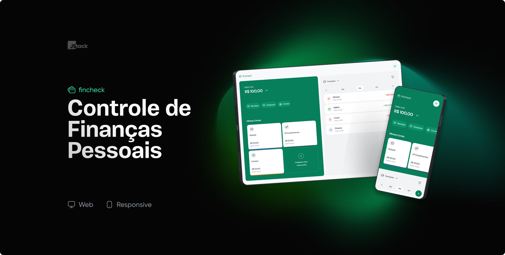
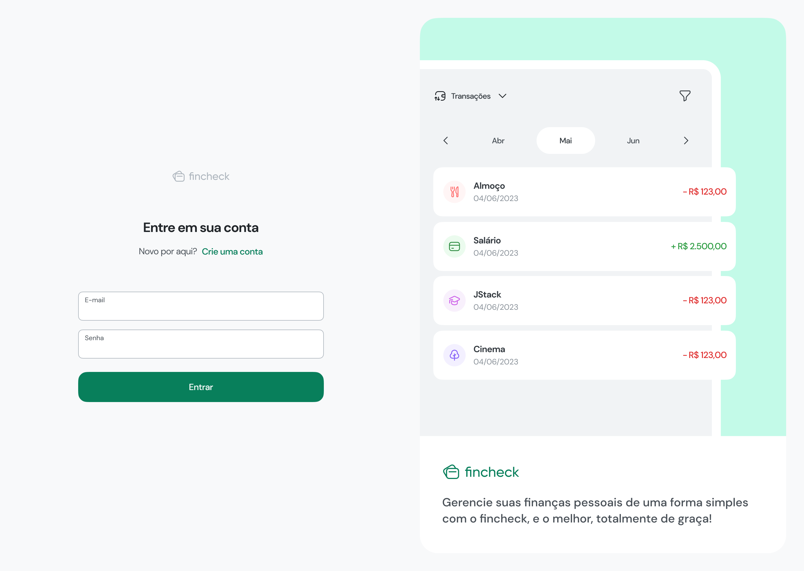
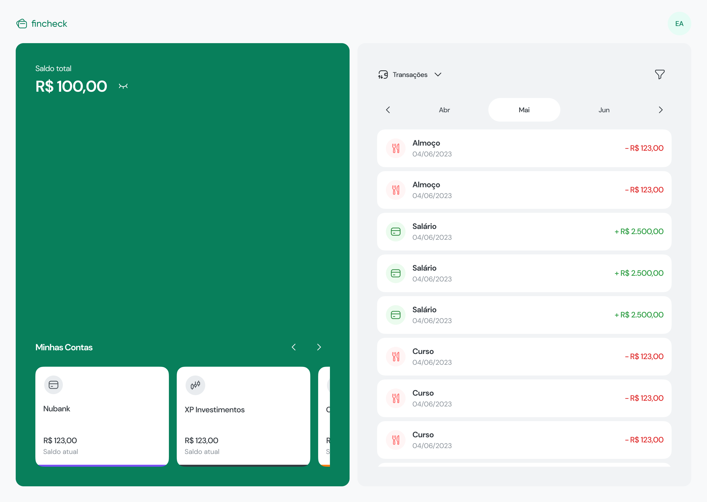
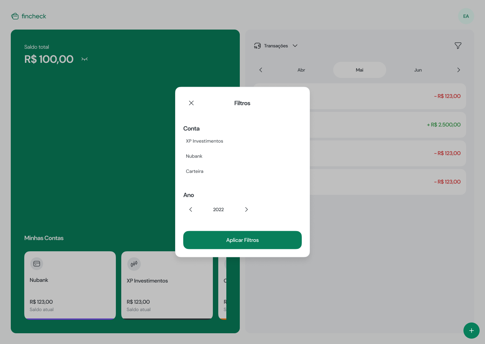

# FINCHECK - Controle suas finanças

> O FINCHECK é uma aplicação para gerenciamento de Finanças pessoais. Monitore seus gastos de forma simples, podendo filtrar por conta, categoria e data.

## 👩‍💻 Tecnologias usadas
  
  ### Back-end
    * NestJS
    * Typescript
    * PostgreSQL
    * Prisma
    * JWT

  ### Front-end Web

    * React / Vite 
    * Typescript
    * TailwindCSS
    * Zod
    * React Query
    
## Preview

### Página de Login

### Página Home

## Página Home Filtro

